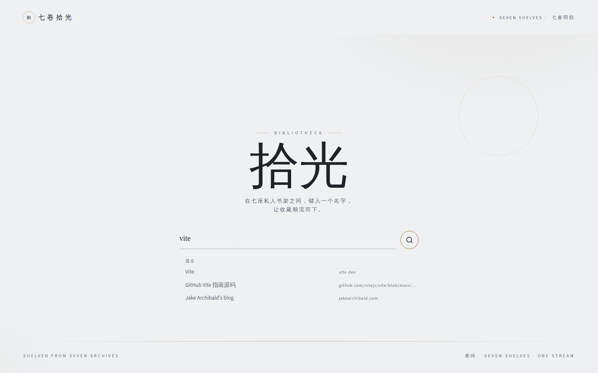
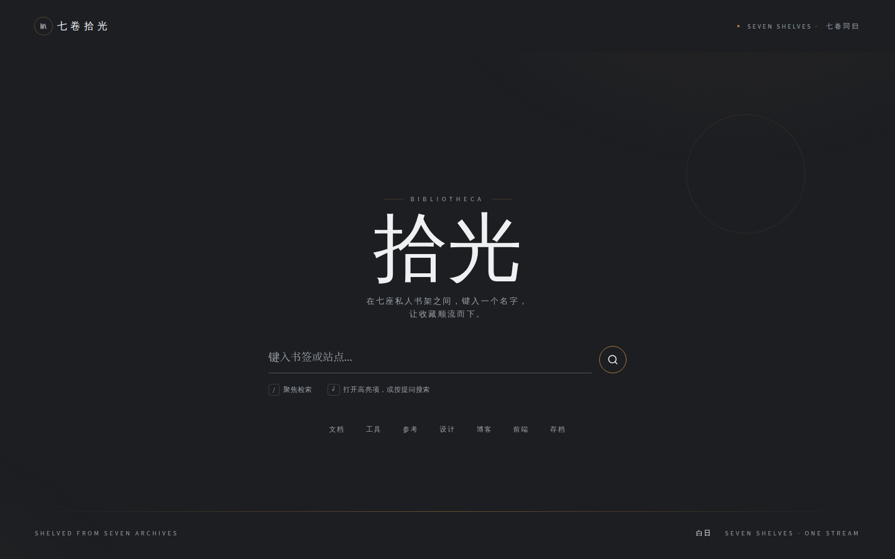
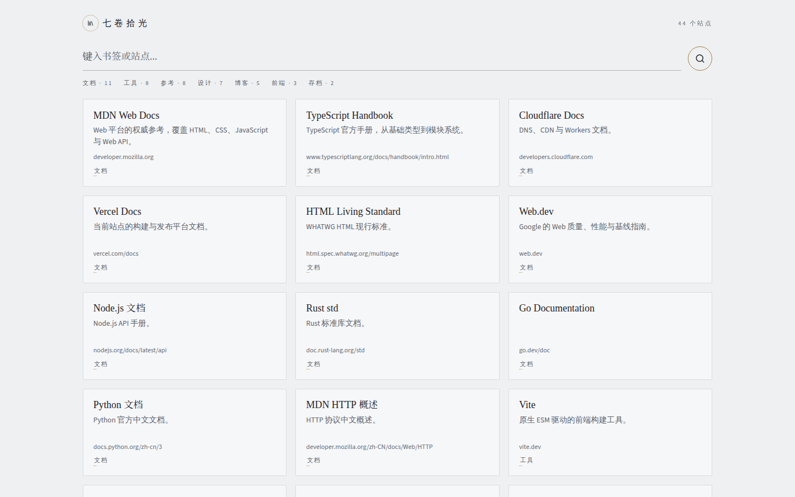

# 七卷拾光

维护者的公开书签目录。打开先进入**搜索厅**：两字碑、一根提问线、最多七个常用标签。提问或点标签之后，**货架**用卡片列出站点。

这不是通用导航站，也没有账号、数据库或后台编辑。收藏和厅面文案都写在仓库里的一份 JSON 里，推送后发布。

线上站点：[portal.jasper0507.me](https://portal.jasper0507.me)

## 预览

搜索厅（白日纸）。空厅是一屏题签，卡片不会出现在这里。


键入提问后，厅内出现题名索引：匹配标签最多三条，题名补齐到约七行。七词在提问时收起。



同一张纸翻到夜里。页脚切换，选择会记在浏览器里。



货架。无提问也无标签时展示全部目录；有提问或标签时只展示命中。点卡片打开外链。



## 特点

- **厅是入口，架是目录。** 默认 `/` 是搜索厅；`/shelf` 才是卡片网格。Logo 始终回到搜索厅。
- **提问和标签两路、互斥。** 框里提交只按提问词全站重搜；点任何标签（七词、建议、结果顶、卡片上的标签）进入该类并清空提问。
- **建议启动、回车搜索。** 点建议或方向键选亮后再回车，才会打开站点或进入该类。未选亮时回车或点放大镜一律按提问词进货架，唯一命中也不会直接打开。空提交看全部货架。
- **模糊匹配，不搜网址。** 提问词用 Fuse.js 在标题、描述、标签上整句模糊匹配，按分数排序，不匹配 URL。
- **七词跟着收藏走。** 搜索厅底部最多七个快捷标签，按被条目引用的次数降序；不够七个就有几个显示几个，不会为凑满而编造。
- **一份 JSON 就是全部内容。** 改书签或厅面文案只编辑 `public/portal.json`。页面上没有添加面板或编辑模式。
- **白日纸 / 夜间纸。** 同一套 DOM，用 `data-paper` 换色板。夜间开关在页脚。
- **没有后端。** 浏览器直接拉取静态 `portal.json`，构建结果可以放到任何静态托管上。

## 技术栈

| 层 | 选择 | 说明 |
| --- | --- | --- |
| 构建 | [Vite](https://vite.dev/) 8 | 开发服务器与静态打包 |
| 语言 | TypeScript | 原生 DOM，不使用 React / Vue |
| 搜索 | [Fuse.js](https://www.fusejs.io/) | 标题、描述、标签的模糊匹配 |
| 界面 | 本项目 CSS | Archive Paper：浅档案纸、金线、衬线碑题 |
| 测试 | Vitest | `src/**/*.test.ts` |
| 发布 | Vercel | 跟 `main` 构建；`vercel.json` 把 `/shelf` 回退到 `index.html` |

运行时依赖只有 Fuse.js。没有 UI 框架、没有组件库、没有数据库。

## 项目结构

```text
webdirectory/
├── public/
│   ├── portal.json          门户源：站点身份 + 书签目录
│   ├── favicon.svg          白日图标（与圆印同一构图）
│   ├── favicon-night.svg    夜间图标
│   └── fonts/               Linux 兜底字体
├── src/
│   ├── main.ts              入口：挂样式并启动
│   ├── app.ts               厅 / 架切换、键盘、提交规则
│   ├── catalog.ts           解析门户源、搜索、七词
│   ├── routes.ts            `/` 与 `/shelf?q=&tag=`
│   ├── theme.ts             白日 / 夜间纸
│   ├── ui.ts                题名索引、七词、卡片分批上屏
│   ├── styles.css           Archive Paper
│   └── *.test.ts
├── index.html               厅、架两套页面骨架
├── vite.config.ts
├── vercel.json              `/shelf` 回退到首页
├── CONTEXT.md               领域术语
├── PRODUCT.md               产品约束
├── DESIGN.md                视觉与交互规格
└── docs/adr/                技术决策
```

改收藏或厅面文案只动 `public/portal.json`。搜索厅和货架的零件在 `src/ui.ts`，不要另起一套 class。

## 快速开始

面向想在本机打开这个门户的人：不需要改代码，也不需要账号。

### 环境

- Node.js **20.19+** 或 **22.12+**（Vite 8 的要求）
- npm（仓库带 `package-lock.json`）

### 安装并运行

```bash
git clone https://github.com/jasper0507/webdirectory.git
cd webdirectory
npm install
npm run dev
```

终端里会出现本地地址，默认是 [http://127.0.0.1:5173/](http://127.0.0.1:5173/)。用浏览器打开即可。

### 怎么用

1. 打开后是搜索厅。空厅不自动聚焦提问框，避免一进来就挡住碑题。
2. 按 `/`，或点提问线，开始输入。输入时下方出现题名索引，七词收起。
3. 用方向键选亮一项再回车：选中站点会新标签打开，选中标签会进入该类货架。
4. 不选任何建议、直接回车或点放大镜：按当前提问词去货架搜索。厅里搜不到时会提示「没有这道题」，回车仍把提问带到货架空态，不会偷偷改成全部目录。
5. 提问框留空再提交，进入全部货架。
6. 点底部七词、货架结果顶的标签、或卡片上的标签，都是「只看这一类」，提问会被清空。
7. 点左上角字标回到搜索厅。页脚「夜间 / 白日」切换纸色，选择保存在本机。

货架上可以继续提问，规则与厅相同：打字出建议，卡片不会边打边变；回车才全站重搜。

```bash
npm test          # 跑测试
npm run build     # 类型检查 + 打包到 dist/
npm run preview   # 本地预览打包结果
```

## 部署方式

站点是纯静态前端。浏览器运行时请求 `/portal.json`，没有服务端接口，也不需要环境变量。

### Vercel（当前用法）

推送到 GitHub `main` 后由 Vercel 自动构建，发布到 `portal.jasper0507.me`。

仓库根目录的 `vercel.json` 已经写好 SPA 回退：直接访问 `/shelf` 或 `/shelf/` 会落到 `index.html`，再由前端读 `?q=` / `?tag=` 画出货架。厅里点进货架走的是 `history.pushState`，不依赖这次回退；回退是给刷新和外链用的。

在 Vercel 上新建项目时：

1. Import 这个 GitHub 仓库。
2. 框架预设用 Vite；构建命令 `npm run build`，输出目录 `dist`。
3. 绑定自定义域名（可选）。

改书签：编辑 `public/portal.json` → 提交并推送 `main` → 等构建完成。

### 其他静态托管

```bash
npm run build
```

把 `dist/` 整目录上传到 Cloudflare Pages、Netlify、对象存储静态网站等。需要保证：

- `index.html`、`/portal.json`、`/assets/*`、`/fonts/*`、favicon 都能按路径访问。
- **`/shelf` 刷新不能 404。** 把 `/shelf` 和 `/shelf/*` 回退到 `index.html`（各平台名称不同：Rewrites、Redirects、SPA fallback）。

GitHub Pages 对 History 路由不友好，需要额外的 404 回退技巧，不作为首选。

### 本机预览生产包

```bash
npm run build
npm run preview
```

`vite preview` 可以打开打包后的站点，适合在推送前确认。它不是生产服务器。

## 维护门户源

权威文件只有 `public/portal.json`。结构如下：

```json
{
  "identity": {
    "wordmark": "七卷拾光",
    "monument": ["拾", "光"],
    "eyebrow": "BIBLIOTHECA",
    "stampEn": "SEVEN SHELVES",
    "convergence": "七卷同归",
    "whisper": ["在七座私人书架之间，键入一个名字，", "让收藏顺流而下。"],
    "placeholder": "键入书签或站点...",
    "colophonLeft": "SHELVED FROM SEVEN ARCHIVES",
    "colophonRight": "SEVEN SHELVES · ONE STREAM"
  },
  "bookmarks": [
    {
      "title": "MDN Web Docs",
      "url": "https://developer.mozilla.org/",
      "tags": ["文档"],
      "description": "可选，可省略。"
    }
  ]
}
```

规则（解析时会跳过不合法或重复的条目，不会整份失败）：

- `monument` 必须是两个汉字；`whisper` 必须是两行。缺了会回落到默认文案。
- 每条书签必须有 `title`、`http(s)` 的 `url`、至少一个标签。
- 标题去重（去首尾空格 + Unicode NFC，大小写敏感）；URL 按标准化去重（小写主机名、去掉默认端口和尾斜杠、去掉 hash）。
- 不要写 `category`。旧分类应写进 `tags`。
- 七词不必写入身份；运行时按标签引用次数生成。

更细的槽位说明见 [`docs/agents/portal-source.md`](docs/agents/portal-source.md)。视觉与交互规格见 [`DESIGN.md`](DESIGN.md)。

## 相关文档

| 文件 | 内容 |
| --- | --- |
| [`CONTEXT.md`](CONTEXT.md) | 搜索厅、货架、门户源、七词等术语 |
| [`PRODUCT.md`](PRODUCT.md) | 产品定位与能力边界 |
| [`DESIGN.md`](DESIGN.md) | Archive Paper 色板、字体、厅架规则 |
| [`docs/adr/`](docs/adr/) | 静态发布、原生前端、标签-only、Fuse 匹配等决策 |
